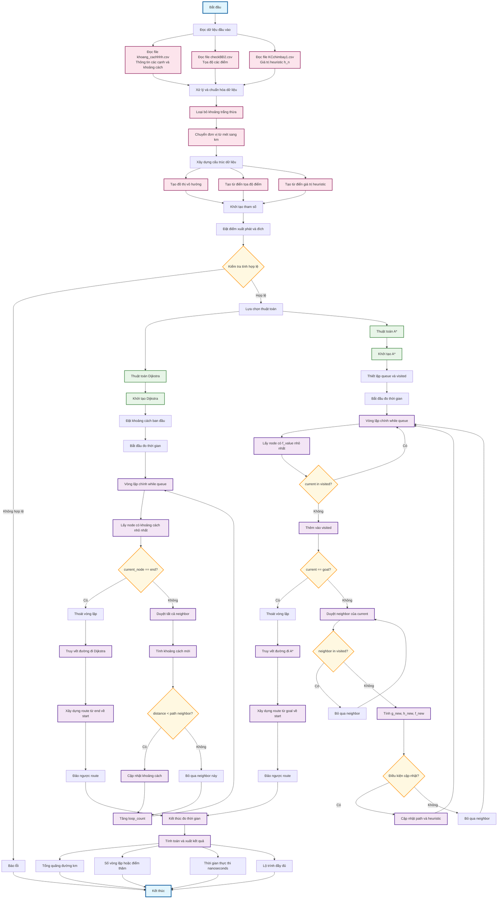

```mermaid
flowchart TD
    A[Bắt đầu] --> B[Đọc dữ liệu đầu vào]
    
    B --> B1[Đọc file khoang_cachhhh.csv<br/>Thông tin các cạnh và khoảng cách]
    B --> B2[Đọc file checkBĐ2.csv<br/>Tọa độ các điểm]
    B --> B3[Đọc file KCchimbay1.csv<br/>Giá trị heuristic h_n]
    
    B1 --> C[Xử lý và chuẩn hóa dữ liệu]
    B2 --> C
    B3 --> C
    
    C --> C1[Loại bỏ khoảng trắng thừa]
    C1 --> C2[Chuyển đơn vị từ mét sang km]
    
    C2 --> D[Xây dựng cấu trúc dữ liệu]
    
    D --> D1[Tạo đồ thị vô hướng]
    D --> D2[Tạo từ điển tọa độ điểm]
    D --> D3[Tạo từ điển giá trị heuristic]
    
    D1 --> E[Khởi tạo tham số]
    D2 --> E
    D3 --> E
    
    E --> E1[Đặt điểm xuất phát và đích]
    
    E1 --> F{Kiểm tra tính hợp lệ}
    
    F -->|Không hợp lệ| G[Báo lỗi]
    F -->|Hợp lệ| H[Lựa chọn thuật toán]
    
    H --> H1[Thuật toán Dijkstra]
    H --> H2[Thuật toán A*]
    
    H1 --> I1[Khởi tạo Dijkstra]
    I1 --> I2[Đặt khoảng cách ban đầu]
    I2 --> I3[Bắt đầu đo thời gian]
    I3 --> I4[Vòng lặp chính while queue]
    I4 --> I5[Lấy node có khoảng cách nhỏ nhất]
    I5 --> I6{current_node == end?}
    I6 -->|Có| J1[Thoát vòng lặp]
    I6 -->|Không| I7[Duyệt tất cả neighbor]
    I7 --> I8[Tính khoảng cách mới]
    I8 --> I9{distance < path neighbor?}
    I9 -->|Có| I10[Cập nhật khoảng cách]
    I9 -->|Không| I11[Bỏ qua neighbor này]
    I10 --> I12[Tăng loop_count]
    I11 --> I12
    I12 --> I4
    
    H2 --> K1[Khởi tạo A*]
    K1 --> K2[Thiết lập queue và visited]
    K2 --> K3[Bắt đầu đo thời gian]
    K3 --> K4[Vòng lặp chính while queue]
    K4 --> K5[Lấy node có f_value nhỏ nhất]
    K5 --> K6{current in visited?}
    K6 -->|Có| K4
    K6 -->|Không| K7[Thêm vào visited]
    K7 --> K8{current == goal?}
    K8 -->|Có| J2[Thoát vòng lặp]
    K8 -->|Không| K9[Duyệt neighbor của current]
    K9 --> K10{neighbor in visited?}
    K10 -->|Có| K11[Bỏ qua neighbor]
    K10 -->|Không| K12[Tính g_new, h_new, f_new]
    K11 --> K9
    K12 --> K13{Điều kiện cập nhật?}
    K13 -->|Có| K14[Cập nhật path và heuristic]
    K13 -->|Không| K15[Bỏ qua neighbor]
    K14 --> K4
    K15 --> K4
    
    J1 --> L1[Truy vết đường đi Dijkstra]
    L1 --> L2[Xây dựng route từ end về start]
    L2 --> L3[Đảo ngược route]
    
    J2 --> L4[Truy vết đường đi A*]
    L4 --> L5[Xây dựng route từ goal về start]
    L5 --> L6[Đảo ngược route]
    
    L3 --> M[Kết thúc đo thời gian]
    L6 --> M
    
    M --> N[Tính toán và xuất kết quả]
    
    N --> N1[Tổng quãng đường km]
    N --> N2[Số vòng lặp hoặc điểm thăm]
    N --> N3[Thời gian thực thi nanoseconds]
    N --> N4[Lộ trình đầy đủ]
    
    N1 --> O[Kết thúc]
    N2 --> O
    N3 --> O
    N4 --> O
    
    G --> O
    
    classDef startEnd fill:#e1f5fe,stroke:#01579b,stroke-width:3px
    classDef process fill:#f3e5f5,stroke:#4a148c,stroke-width:2px
    classDef decision fill:#fff8e1,stroke:#ff8f00,stroke-width:2px
    classDef algorithm fill:#e8f5e8,stroke:#2e7d32,stroke-width:2px
    classDef data fill:#fce4ec,stroke:#880e4f,stroke-width:2px
    
    class A,O startEnd
    class B1,B2,B3,C1,C2,D1,D2,D3 data
    class H1,H2,I1,K1 algorithm
    class F,I6,I9,K6,K8,K10,K13 decision
    class I4,I5,I7,I8,I10,I12,K4,K5,K7,K9,K12,K14,L1,L2,L4,L5,M,N process
```