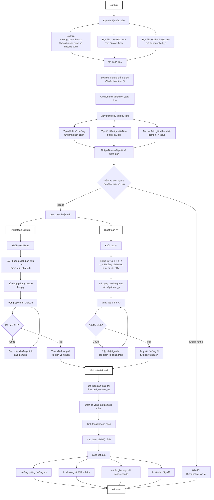

```mermaid
flowchart TD
    A[Bắt đầu] --> B[Đọc dữ liệu đầu vào]
    
    B --> B1[Đọc file khoang_cachhhh.csv<br/>Thông tin các cạnh và khoảng cách]
    B --> B2[Đọc file checkBĐ2.csv<br/>Tọa độ các điểm]
    B --> B3[Đọc file KCchimbay11.csv<br/>Giá trị heuristic h_n]
    
    B1 --> C[Xử lý dữ liệu]
    B2 --> C
    B3 --> C
    
    C --> C1[Loại bỏ khoảng trắng thừa<br/>Chuẩn hóa tên cột]
    C1 --> C2[Chuyển đơn vị từ mét sang km]
    
    C2 --> D[Xây dựng cấu trúc dữ liệu]
    
    D --> D1[Tạo đồ thị vô hướng<br/>từ danh sách cạnh]
    D --> D2[Tạo từ điển tọa độ điểm<br/>point: lat, lon]
    D --> D3[Tạo từ điển giá trị heuristic<br/>point: h_n value]
    
    D1 --> E[Nhập điểm xuất phát và điểm đích]
    D2 --> E
    D3 --> E
    
    E --> F{Kiểm tra tính hợp lệ<br/>của điểm đầu và cuối}
    
    F -->|Không hợp lệ| G[Báo lỗi:<br/>Điểm không tồn tại]
    F -->|Hợp lệ| H[Lựa chọn thuật toán]
    
    H --> H1[Thuật toán Dijkstra]
    H --> H2[Thuật toán A*]
    
    H1 --> I1[Khởi tạo Dijkstra]
    I1 --> I2[Đặt khoảng cách ban đầu = ∞<br/>Điểm xuất phát = 0]
    I2 --> I3[Sử dụng priority queue<br/>heapq]
    I3 --> I4[Vòng lặp chính Dijkstra]
    I4 --> I5{Đã đến đích?}
    I5 -->|Chưa| I6[Cập nhật khoảng cách<br/>các điểm kề]
    I6 --> I4
    I5 -->|Rồi| J1[Truy vết đường đi<br/>từ đích về nguồn]
    
    H2 --> K1[Khởi tạo A*]
    K1 --> K2[Tính f_n = g_n + h_n<br/>g_n: khoảng cách thực<br/>h_n: từ file CSV]
    K2 --> K3[Sử dụng priority queue<br/>sắp xếp theo f_n]
    K3 --> K4[Vòng lặp chính A*]
    K4 --> K5{Đã đến đích?}
    K5 -->|Chưa| K6[Cập nhật f_n cho<br/>các điểm kề chưa thăm]
    K6 --> K4
    K5 -->|Rồi| J2[Truy vết đường đi<br/>từ đích về nguồn]
    
    J1 --> L[Tính toán kết quả]
    J2 --> L
    
    L --> L1[Đo thời gian thực thi<br/>time.perf_counter_ns]
    L1 --> L2[Đếm số vòng lặp/điểm đã thăm]
    L2 --> L3[Tính tổng khoảng cách]
    L3 --> L4[Tạo danh sách lộ trình]
    
    L4 --> M[Xuất kết quả]
    
    M --> M1[In tổng quãng đường km]
    M --> M2[In số vòng lặp/điểm thăm]
    M --> M3[In thời gian thực thi nanoseconds]
    M --> M4[In lộ trình đầy đủ]
    
    M1 --> N[Kết thúc]
    M2 --> N
    M3 --> N
    M4 --> N
    
    G --> N
    
    style A fill:#ffffff,stroke:#000000,stroke-width:2px
    style N fill:#ffffff,stroke:#000000,stroke-width:2px
    style H1 fill:#ffffff,stroke:#000000,stroke-width:2px
    style H2 fill:#ffffff,stroke:#000000,stroke-width:2px
    style L fill:#ffffff,stroke:#000000,stroke-width:2px
```